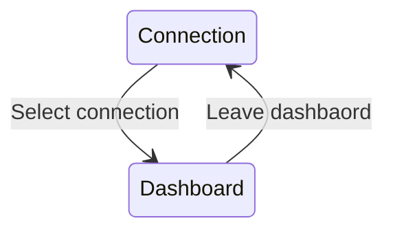
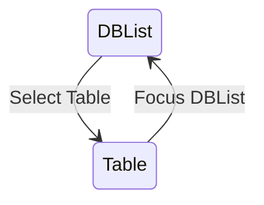
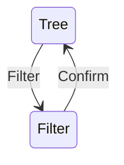
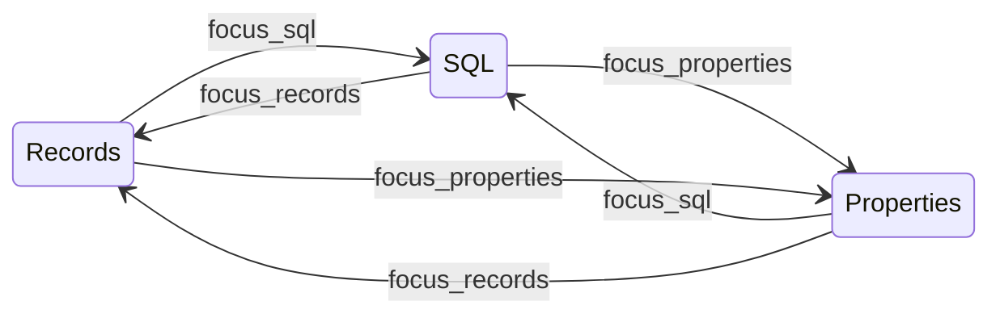
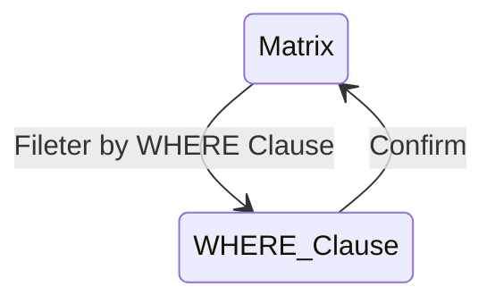

# Automaton

## App

## Dashboard

## DBList

## Table

### Records

### Properties

WIP

### SQL

WIP

# Key Effect

## Dashboard -> DBList -> Tree

| Action | Default Keybind | Description |
| --- | --- | --- |
| Cursor Up | j | Move selection cursor up |
| Cursor Down | k | Move selection cursor down |
| Expand | l | Expand sibling items from selected item's parent. If there is no child, do nothing. |
| Fold | h | Fold sibling items into selected item's parent or itself. If there is no child, do nothing. |
| Cursor Top | g | Move selection cursor top |
| Cursor Bottom | G  | Move selection cursor bottom |
| Select Table | Enter | Dispatch Table Selected Msg with data of database and table |
| Filter | / | Move focus to filter query bar |

## Dashboard -> DBList -> Filter

| Keybind | Effect |
| --- | --- |
| char | Update filter query |
| Confirm | Confirm filter query and focus back to tree |

### note

- Fileter Result is incrementally updated
- (Optional) Support unix like shortcut key e.g. Delete all characters from head of line to cursor

## Dashboard -> Table -> Records -> Matrix

| Action | Default Keybind | Description |
| --- | --- | --- |
| Cursor Up | j | Move selection cursor up |
| Cursor Down | k | Move selection cursor down |
| Cursor Left | l | Move selection cursor left |
| Cursor Right | h | Move selection cursor right |
| Cursor Top | g | Move selection cursor top |
| Cursor Bottom | G  | Move selection cursor bottom |
| Filter | / | Move focus to filter query bar |

## Dashboard -> Table -> Records -> WHERE Clause

| Keybind | Effect |
| --- | --- |
| char | Update filter query |
| Confirm | Confirm filter query and focus back to tree |
