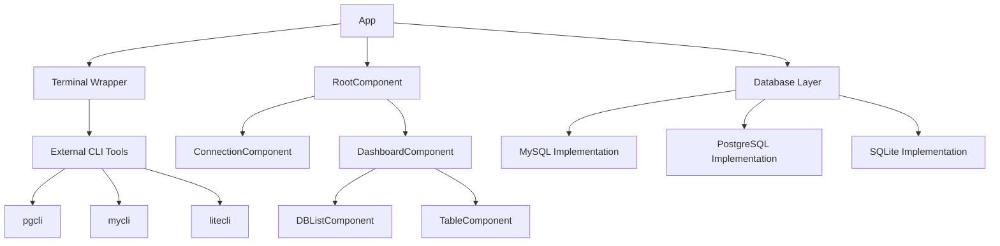
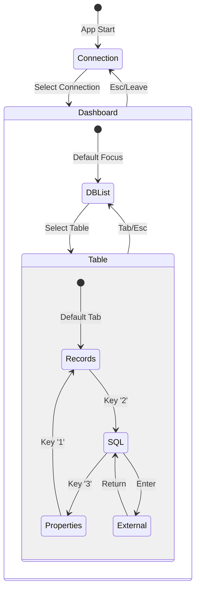

# clazydbm Architecture

This document describes the architecture and design patterns used in clazydbm, a terminal-based database management tool.

## Overview

clazydbm follows a component-based architecture with a message-passing system inspired by The Elm Architecture (TEA). Each component manages its own state and communicates through typed messages.

## System Architecture



## Core Components

### App Layer (`src/app.rs`)

The main application controller that:
- Manages the terminal and event loop
- Handles keyboard input and routing
- Coordinates between components via message passing
- Manages asynchronous command execution

```rust
pub struct App<B: Backend> {
    term: Terminal<B>,
    root: RootComponent,
    rx: Receiver<AppMsg>,
    tx: Sender<AppMsg>,
    should_quit: bool,
}
```

### Component System

#### RootComponent (`src/component/root.rs`)
- Top-level component managing application state
- Routes between Connection and Dashboard views
- Handles global state transitions

#### DashboardComponent (`src/component/dashboard.rs`) 
- Main workspace with dual-pane layout
- Manages focus between DBList and Table components
- Coordinates database/table selection flow

#### DBListComponent (`src/component/dblist.rs`)
- Tree-based database structure browser
- Real-time search/filtering functionality
- Hierarchical navigation (databases → tables)

#### TableComponent (`src/component/table.rs`)
- Multi-tab interface for table operations
- **Records Tab**: Paginated data viewing with scrolling
- **SQL Tab**: External CLI tool integration
- **Properties Tab**: Column metadata and constraints

#### ConnectionComponent (`src/component/connection.rs`)
- Connection selection and management
- Configuration loading and validation

### Database Abstraction Layer (`src/db/`)

#### DBBehavior Trait (`src/db/mod.rs`)
Defines a common interface for all database operations:

```rust
pub trait DBBehavior: Send + Sync {
    fn database_url(conn: &Connection) -> Result<String>;
    fn fetch_databases(conn: &Connection) -> Result<Vec<Database>>;
    fn fetch_records(conn: &Connection, database: &str, table: &str, limit: usize, offset: usize) -> Result<Records>;
    fn fetch_properties(conn: &Connection, database: &str, table: &str) -> Result<TableProperties>;
    
    // CLI tool integration
    fn cli_tool_name() -> &'static str;
    fn is_cli_tool_available() -> bool;
    fn launch_cli_tool(conn: &Connection) -> Result<std::process::ExitStatus>;
}
```

#### Database Implementations
- **MySQL** (`src/db/mysql.rs`): MySQL/MariaDB support with `mycli` integration
- **PostgreSQL** (`src/db/postgres.rs`): PostgreSQL support with `pgcli` integration  
- **SQLite** (`src/db/sqlite.rs`): SQLite support with `litecli` integration

### Terminal Management (`src/terminal.rs`)

Custom terminal wrapper providing:
- Proper terminal state management
- Suspend/restore functionality for external tools
- Clean separation between TUI and CLI operations

```rust
pub struct Terminal<B: Backend> {
    inner: RatatuiTerminal<B>,
}

impl<B: Backend> Terminal<B> {
    pub fn with_suspended<F, R>(&mut self, f: F) -> Result<R>
    where F: FnOnce() -> Result<R>;
}
```

## Message System

### Update Pattern
Each component implements the Update pattern:

```rust
pub trait Component {
    type Msg;
    fn update(&mut self, msg: Self::Msg) -> Update<Self::Msg>;
    fn handle_key(&self, key: KeyEvent) -> Update<Self::Msg>;
    fn draw(&self, f: &mut Frame, area: Rect, focused: bool);
}
```

### Command System
Asynchronous operations are handled via commands:

```rust
pub enum Command {
    None,
    Batch(Vec<Command>),
    Spawn(Box<dyn FnOnce(Sender<AppMsg>) + Send>),
    SuspendTerminal(Box<dyn FnOnce() -> Result<(), Box<dyn std::error::Error>> + Send>),
}
```

## State Flow



## Key Bindings

### Global Navigation
- `Tab`/`Shift+Tab`: Switch focus between components
- `Esc`: Go back/up in hierarchy
- `Ctrl+C`: Quit application

### Database List
- `↑`/`↓` or `j`/`k`: Navigate items
- `Enter`: Select database/table
- `/`: Start search filter
- `Esc`: Clear filter

### Table View
- `1`: Records tab
- `2`: SQL tab  
- `3`: Properties tab

#### Records Tab
- `↑`/`↓` or `j`/`k`: Scroll rows
- `←`/`→` or `h`/`l`: Scroll columns
- `[`/`]`: Jump 5 columns
- `Ctrl+A`/`Ctrl+E`: First/last column
- `Home`/`End`: Top/bottom row
- `PgUp`/`PgDn`: Page up/down

#### SQL Tab
- `Enter`: Launch external CLI tool

## Configuration

### Connection Configuration (`src/config.rs`)
- YAML-based connection storage
- Cross-platform config directory support
- Secure connection parameter management

### Example Configuration
```yaml
connections:
  - name: "Production DB"
    type: postgres
    host: localhost
    port: 5432
    user: admin
    password: secret
    database: app_db
```

## External CLI Integration

clazydbm seamlessly integrates with popular database CLI tools:

| Database | CLI Tool | Features |
|----------|----------|----------|
| PostgreSQL | `pgcli` | Auto-completion, syntax highlighting |
| MySQL | `mycli` | Auto-completion, syntax highlighting |
| SQLite | `litecli` | Auto-completion, syntax highlighting |

The integration:
1. Detects tool availability
2. Suspends the TUI properly
3. Launches the CLI with connection parameters
4. Restores the TUI when the CLI exits

## Error Handling

- `anyhow::Result` for error propagation
- Graceful degradation for missing CLI tools
- User-friendly error messages in the UI
- Proper cleanup on failures

## Threading Model

- Main thread: UI rendering and event handling
- Background threads: Database operations via `Command::Spawn`
- Terminal suspension: Synchronous execution via `Command::SuspendTerminal`

## Design Principles

1. **Separation of Concerns**: Clear boundaries between UI, business logic, and data access
2. **Type Safety**: Leveraging Rust's type system for correctness
3. **Composability**: Reusable components with well-defined interfaces
4. **Responsiveness**: Non-blocking operations for smooth user experience
5. **Extensibility**: Easy to add new database types or features

## Inspiration

This architecture was greatly inspired by [gobang](https://github.com/TaKO8Ki/gobang) and The Elm Architecture, adapted for Rust and terminal applications.
