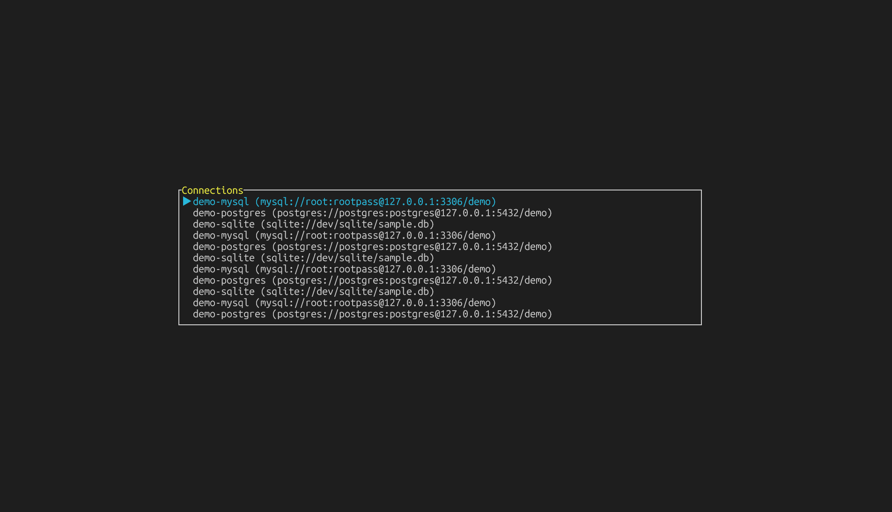
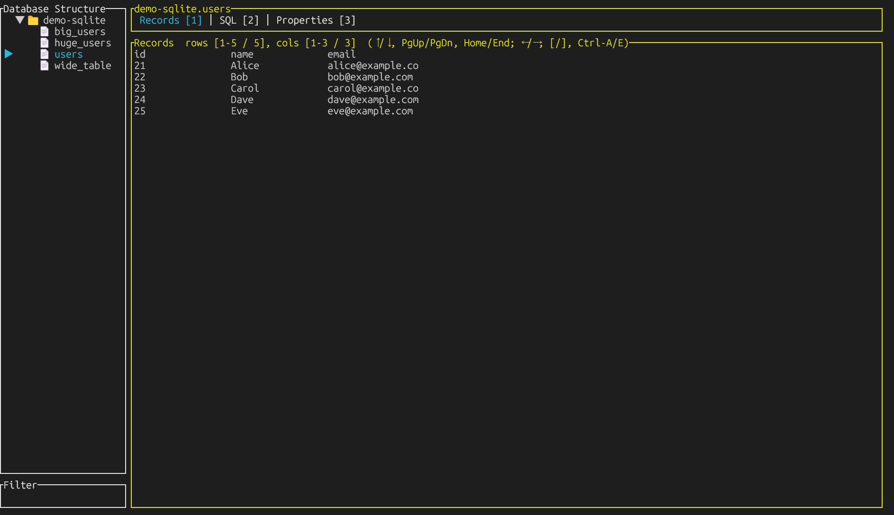
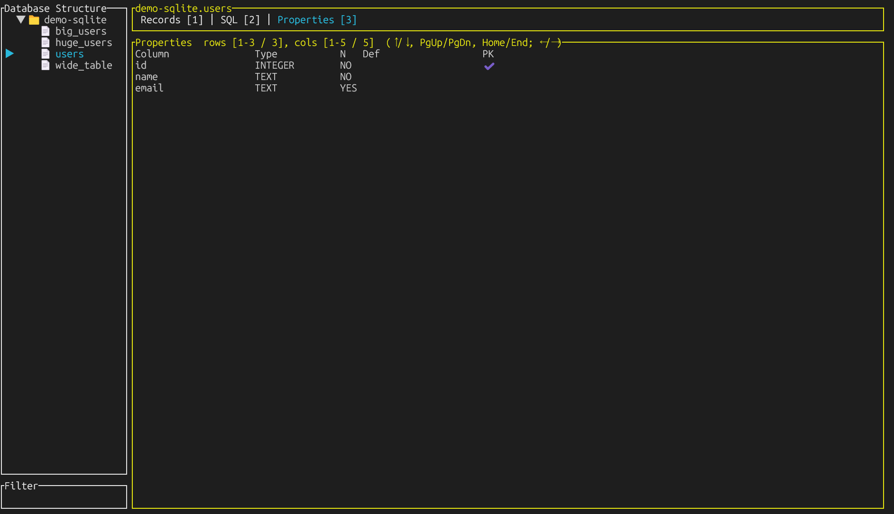

# clazydbm

A modern Terminal User Interface (TUI) database management tool for PostgreSQL, MySQL, and SQLite.

## Screenshots

### Connection Selection


### Database Records View


### Table Properties View


## Features

- **📊 Multi-database support**: Connect to PostgreSQL, MySQL, and SQLite databases
- **🖥️ Clean TUI interface**: Modern terminal interface built with Ratatui
- **🔍 Database exploration**: Navigate through databases, tables, and schemas with ease
- **📋 Data viewing**: Browse table records with pagination and horizontal scrolling
- **⚙️ Table inspection**: View detailed column information, data types, and constraints
- **🚀 CLI integration**: Launch pgcli, mycli, or litecli directly from the SQL tab
- **💾 Connection management**: Save and organize multiple database connections
- **🔎 Live search**: Real-time filtering of databases and tables
- **⌨️ Keyboard-driven**: Full keyboard navigation with intuitive shortcuts

## Installation

### From source

```bash
git clone https://github.com/your-username/clazydbm.git
cd clazydbm
cargo install --path .
```

### Prerequisites

For SQL tab functionality, install the appropriate CLI tools:

```bash
# PostgreSQL
pip install pgcli

# MySQL
pip install mycli

# SQLite
pip install litecli
```

## Usage

### Basic Usage

```bash
clazydbm
```

### Configuration

On first run, clazydbm will create a configuration directory in your home folder. Edit the connections file to add your database connections:

**Linux/macOS**: `~/.config/clazydbm/connections.yaml`
**Windows**: `%APPDATA%/clazydbm/connections.yaml`

Example configuration:

```yaml
connections:
  - name: "Local PostgreSQL"
    type: postgres
    host: localhost
    port: 5432
    user: postgres
    password: password
    database: mydb

  - name: "Local MySQL"
    type: mysql
    host: localhost
    port: 3306
    user: root
    password: password
    database: mydb

  - name: "SQLite Database"
    type: sqlite
    path: "./example.db"
```

### Keyboard Shortcuts

#### Navigation
- `Tab` / `Shift+Tab`: Switch between panels
- `↑↓` / `jk`: Navigate lists
- `Enter`: Select item / Open table
- `Esc`: Go back

#### Table View
- `1`: Focus on Records tab
- `2`: Focus on SQL tab  
- `3`: Focus on Properties tab
- `←→` / `hl`: Scroll columns horizontally
- `[]`: Jump 5 columns left/right
- `Ctrl+A` / `Ctrl+E`: Jump to first/last column
- `PgUp` / `PgDn`: Scroll rows vertically
- `Home` / `End`: Jump to top/bottom

#### SQL Tab
- `Enter`: Launch external CLI tool (pgcli/mycli/litecli)

#### General
- `Ctrl+C`: Quit application

## Architecture

clazydbm is built with a modular architecture:

- **Database abstraction**: Clean trait-based interface for different database types
- **Component-based UI**: Reusable UI components with message-passing architecture  
- **Terminal management**: Proper terminal suspension/restoration for external tools
- **Asynchronous operations**: Non-blocking database operations

## Supported Databases

| Database | Status | CLI Integration |
|----------|--------|-----------------|
| PostgreSQL | ✅ | pgcli |
| MySQL | ✅ | mycli |
| SQLite | ✅ | litecli |

## Contributing

Contributions are welcome! Please feel free to submit a Pull Request.

## Acknowledgments

This project was greatly inspired by [gobang](https://github.com/TaKO8Ki/gobang) by [TaKO8Ki](https://github.com/TaKO8Ki). We are grateful for the excellent foundation and design patterns that gobang provided for building terminal-based database management tools.

## License

MIT License - see LICENSE file for details
